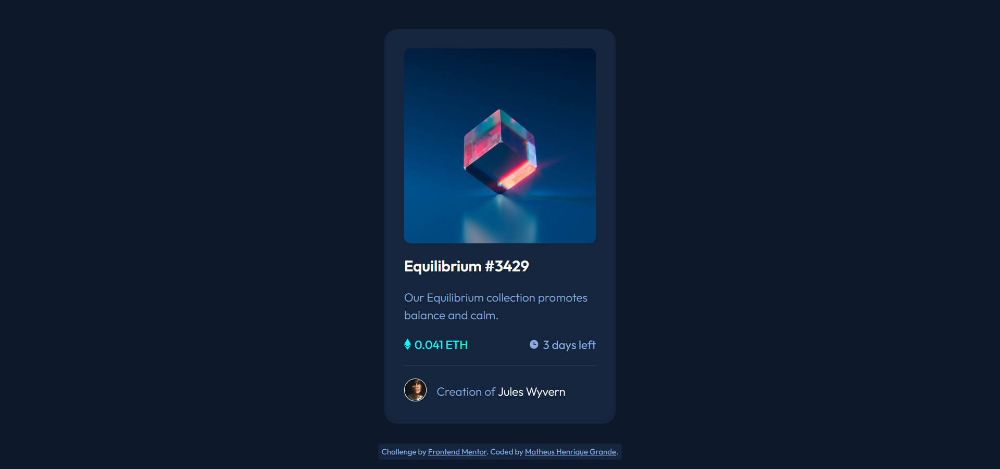

# Frontend Mentor - NFT preview card component solution

This is a solution to the [NFT preview card component challenge on Frontend Mentor](https://www.frontendmentor.io/challenges/nft-preview-card-component-SbdUL_w0U). Frontend Mentor challenges help you improve your coding skills by building realistic projects. 

## Table of contents

- [Overview](#overview)
  - [The challenge](#the-challenge)
  - [Screenshot](#screenshot)
  - [Links](#links)
- [My process](#my-process)
  - [Built with](#built-with)
  - [What I learned](#what-i-learned)
  - [Continued development](#continued-development)
  - [Useful resources](#useful-resources)
- [Author](#author)

## Overview

### The challenge

Users should be able to:

- View the optimal layout depending on their device's screen size
- See hover states for interactive elements

### Screenshot

### Links

- Solution URL: [GitHub](https://github.com/MatheusHG94/NFT-card)
- Live Site URL: [GitHub Pages](https://your-live-site-url.com)

## My process

### Built with

- Semantic HTML5 markup
- CSS custom properties
- Flexbox
- Mobile-first workflow

### What I learned

This is one of my first Frontend Mentor challenges. I'm trying to learn more about flexbox and how to use its attributes to properly display the elements on different screens sizes. I also used some hover features to display some elements over an image, which I thought quite nice.

### Continued development

Since I'm just starting my learning of HTML, CSS and web development in general, I'm still focusing on learning every aspect of these technologies, especially the fundamentals.

### Useful resources

- [W3 Schools](https://www.w3schools.com/) - This source is helping me a lot in understanding the aspects of each element and attribute of HTML5 and CSS3.

## Author

Matheus Henrique Grande

- GitHub - [@MatheusHG94](https://github.com/MatheusHG94)
- Frontend Mentor - [@MatheusHG94](https://www.frontendmentor.io/profile/MatheusHG94)
- LinkedIn - [@matheushg-7654](https://www.linkedin.com/in/matheushg-7654/)